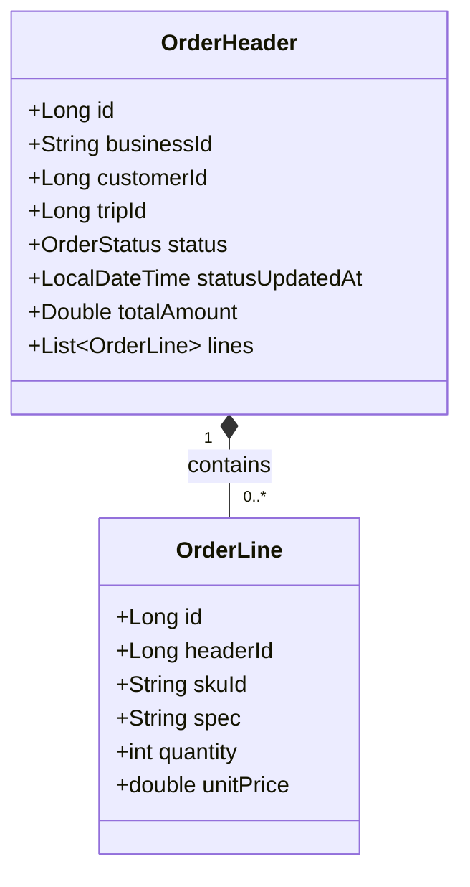
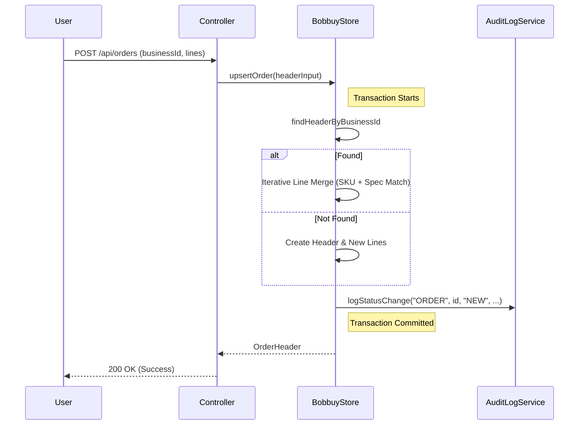

# ARCH-11: 订单头行模型与业务幂等详细设计 (Detailed Design)

**生效日期**: 2026-01-17  
**状态**: 待评审  
**引用**: [PROD-03-订单业务幂等与合并需求说明书.md](PROD-03-订单业务幂等与合并需求说明书.md), [ARCH-04-订单确认模块详细设计.md](ARCH-04-订单确认模块详细设计.md)

---

## 1. 系统架构与设计模式
本详设方案将原有的 `Order` 类重构为逻辑上的 **Master-Detail (Header-Line)** 模式。通过物理层面的“头行分离”支撑业务层面的“增量合并”。

### 1.1 静态结构 (Class Diagram)


---

## 2. 核心算法设计 (Core Logic)

### 2.1 业务幂等与合并算法 (Upsert Strategy)
处理器在接收到请求时，必须遵循以下逻辑：

```pseudo
function upsertOrder(request):
    // 1. 查找现有头
    header = findHeaderByBusinessId(request.businessId)
    
    if header == null:
        // 新建逻辑
        header = createNewHeader(request)
        for lineRequest in request.lines:
            createLine(header.id, lineRequest)
    else:
        // 合并逻辑
        for lineRequest in request.lines:
            existingLine = findLineMatch(header.id, lineRequest.skuId, lineRequest.spec)
            if existingLine != null:
                // 仅当 spec 完全一致时合并数量
                existingLine.quantity += lineRequest.quantity
                updateLine(existingLine)
            else:
                // skuId 相同但 spec不一致，必须独立成行
                createLine(header.id, lineRequest)
    
    recalculateTotalAmount(header)
```

### 2.2 流程交互 (Sequence Diagram)


---

## 3. 物理数据模型 (Logical Schema)

### 3.1 OrderHeader (头表)
| 属性 | Java 类型 | 说明 |
| :--- | :--- | :--- |
| `id` | `Long` | 物理 ID |
| `businessId` | `String` | 业务主键 (如 `202601170001`) |
| `totalAmount` | `double` | 冗余字段，行金额累计 |

### 3.2 OrderLine (行表)
| 属性 | Java 类型 | 说明 |
| :--- | :--- | :--- |
| `id` | `Long` | 物理 ID |
| `skuId` | `String` | 商品唯一标识 |
| `spec` | `String` | 规格/属性描述 (用于隔离权重品) |

---

## 4. 关键实现细节 (Implementation Notes)

### 4.1 事务与并发 (Concurrency)
- **锁机制**: 必须在 `BobbuyStore` 的合并方法上加 `synchronized` 或使用 `header.businessId` 进行分布式锁定。
- **原子性**: 确保 Header 更新与 Line 合并在同一原子操作内。

### 4.2 错误处理
- 若 `businessId` 匹配但 `customerId` 冲突，应抛出 `INVALID_REQUEST` 异常，防止非法的跨用户编号冒用。

---
**核准**: Architect  
**存档**: design/ARCH-11.md
