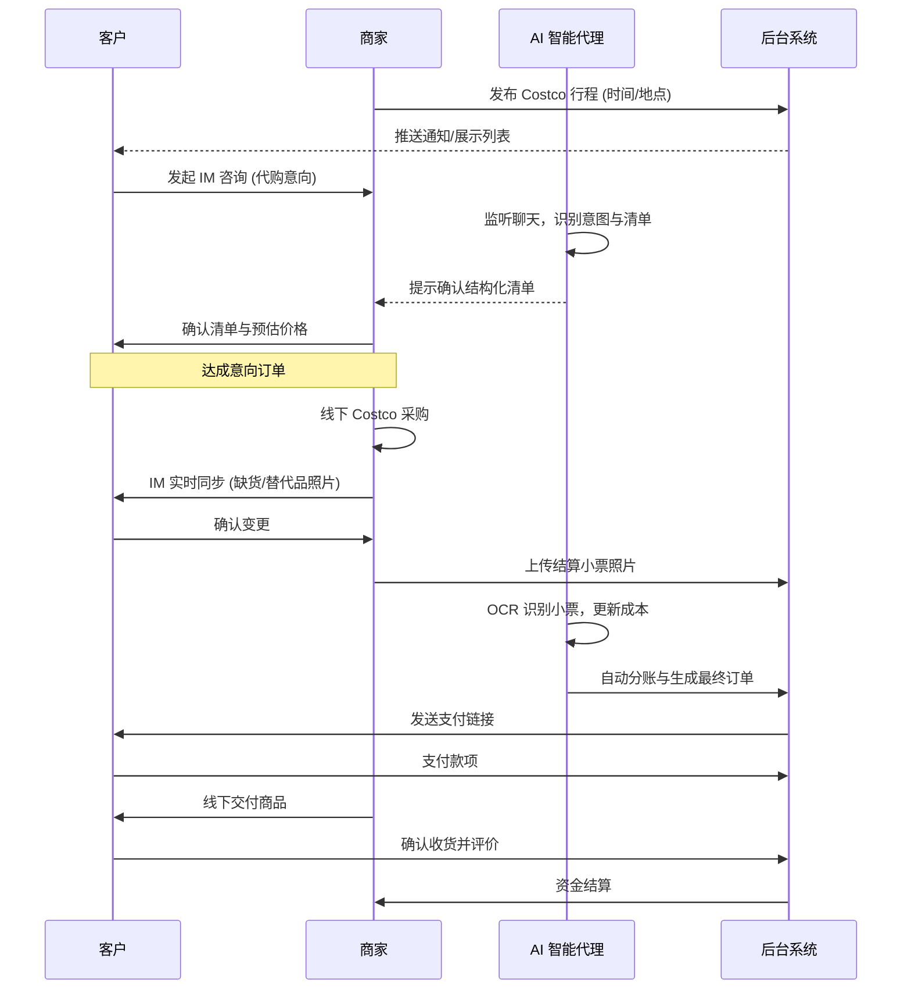

# PROD-02: 业务功能详细说明

**生效日期**: 2026-01-13
**状态**: 草案
**引用**: [BOBBuy 平台系统方案设计.docx](../BOBBuy%20平台系统方案设计.docx)

---

## 1. 业务全景流程图
平台核心逻辑在于通过 AI 智能代理衔接 IM 沟通与线下执行。

## 2. 核心功能操作流程

### 2.1 商家端：行程与采购管理
1.  **行程发布**：
    -   操作：商家在移动端点击“发布行程”，选择目标 Costco 门店，设定计划出发时间及停止接单时间。
    -   系统响应：生成行程卡片，广播至周边潜客。
2.  **订单确认 (AI 协作)**：
    -   操作：商家查看 IM 中 AI 解析出的结构化清单，核对品名、规格、预估单价。
    -   操作：商家点击“一键转订单”，系统生成意向单并锁定配额。
3.  **采购执行与同步**：
    -   操作：商家在采购现场，如遇缺货，拍摄货架照片。
    -   系统响应：AI 识别照片中的候选商品，辅助商家发给客户询问。
4.  **最终结账与分单**：
    -   操作：商家结账后，拍摄 Costco 原始小票。
    -   系统响应：AI OCR 提取各单品实价，根据权重自动平摊公共费用（运费、会员返利补偿等），生成客户支付单。

### 2.2 客户端：发现与支付流程
1.  **探索发现**：
    -   操作：客户通过区域地图或列表浏览可用的代购行程。
    -   系统响应：基于客户历史偏好突出显示“常关顾的商家”。
2.  **清单交互 (AI 解析)**：
    -   操作：客户在 IM 窗口直接回复“我要买两个 1.13kg 的 Kirkland 坚果，再要一箱牛奶”。
    -   系统响应：AI 自动在输入框上方弹出预览清单确认按钮。
3.  **支付与履约**：
    -   操作：客户收到 AI 汇总的最终账单，确认后跳转支付。
    -   操作：面交时，扫描商家提供的核销码完成收货。

### 2.3 AI 智能代理逻辑
-   **意图识别 (NLP)**：通过大模型实时过滤掉闲聊，只提取包含“求购、清单、确认、取消”等关键词的有效指令。
-   **清单结构化**：将非标文本转为标准 SKU（库存单位）。
-   **OCR 自动化**：针对日文 Costco 小票，自动对应商品代码与平台商品库，确保存储的商品数据持续更新。

## 3. 异常处理流程
-   **纠纷仲裁**：客户对商品实价有疑义 -> 系统调取 AI 识别的小票数据对质 -> 无法达成一致时接入人工客服，客服可查看经脱敏的 IM 记录进行判定。
-   **临时退单**：客户在商家采购前可取消 -> 退还全款；采购后不可取消（除非质量问题）。

## 4. 扩展性预留
-   **多语言翻译**：中日文自动识别并翻译，降低沟通门槛。
-   **第三方 Bot 接入**：由于日本用户偏好 Line，系统需支持 Webhook 接收 Line 消息，由 AI 处理后同步至平台后端。
